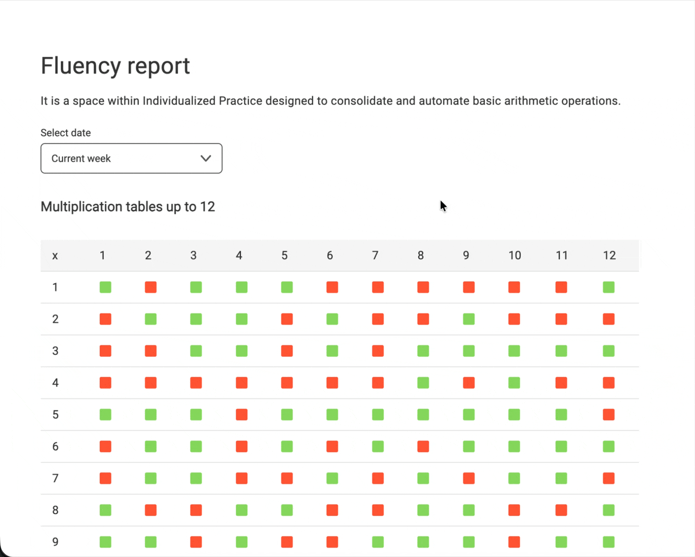
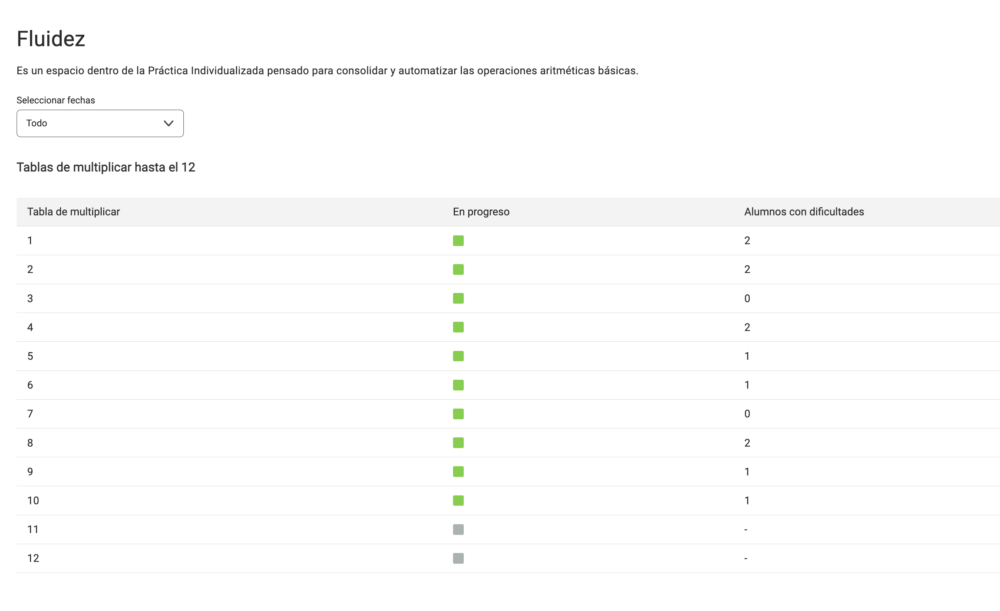
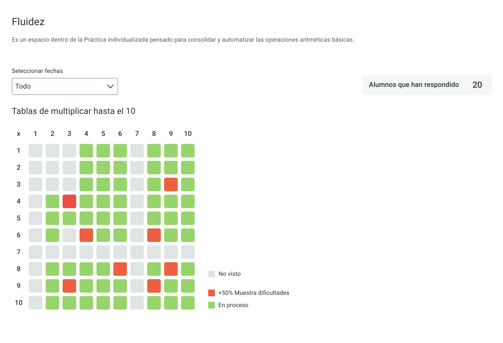

# Fluency report



## Context

The fluency zone is a section of the Individualized Practice app for students to develop factual fluency. The goal is to learn and automatize multiplication tables and additive calculations, using techniques like Spaced Repetition to make the learning process efficient.

We'll focus on the multiplication tables for this exercise. Each multiplication (or fact to learn) is a _card_, that students will have to answer correctly in the app. Here's a screenshot of a multiplication card:


## The starting point 

Teachers use our Classroom Manager to see and manage all things related to their classes and students. They have a Reports section to track the progress of the students in the Individualized Practice.

This repository has a starting report for the fluency progress. We show a simple table that shows the status of each multiplication table. 




## The goal

We want to improve the report to show a classroom's progress in learning the multiplication tables, with info for each card.

Here's the proposed design: 



We want to show a matrix with the classroom performance of each card. The matrix will have 12x12 rows. Rows indicate the “first operand”, columns the “second operand”. Each card is shown in a different color depending on the classroom's status.

The possible statuses are:

- Unseen: no attempts
- Failed: for > 50 % students, the latest attempt is failed
- In Progress: There are some attempts and it's not _Failed_

We also want a filter to be able to filter by dates. The dropdown should have options for _All time_, _Past month_, and _Current week_.


## Tech solution

The UI is built with React and Vite, using Emotion for styling. Data processing in the frontend follows a functional paradigm: pure functions, `useMemo` for memoization, and utilities like `Map.groupBy` and `Object.groupBy` are used to transform and group student attempts without mutating the original state. This approach ensures efficient, predictable state management and enables fast rendering of the results table and date filters.

**Frontend technical highlights:**
- Functional programming for data transformation: summaries, grouping, and filtering are done immutably.
- Render optimization with `useMemo` and decoupled components.
- Date filter dropdown and efficient rendering of a 12x12 matrix table.

### Get your BE ready
1. `make fixtures`
2. `make start-api`

### How to start the Frontend

Start the frontend development server:
```bash
	cd ui
	npm run dev
	# Access the UI at http://localhost:5173 (default Vite port)
```

### Unit tests
Run: `npm run test`.